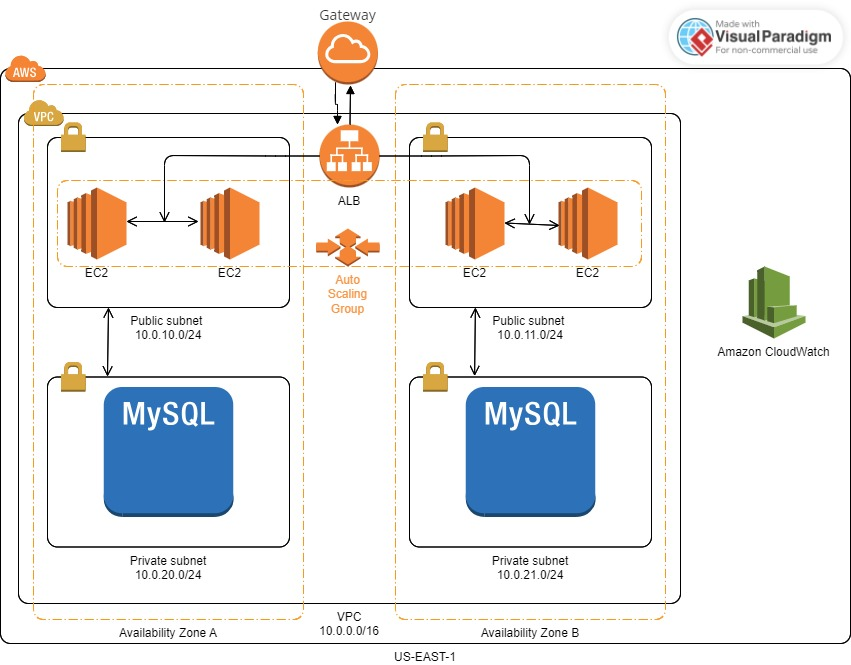
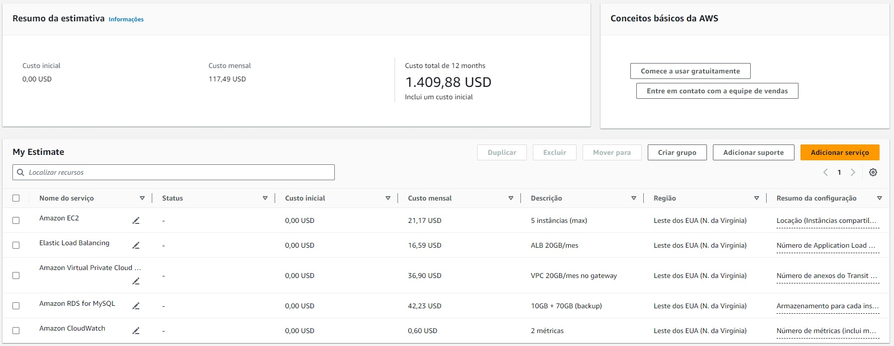

# Implementação de Arquitetura Cloud na AWS com Terraform

#### Caio de Camargo Aranha Tieri

## Objetivo: 
 Provisionar uma arquitetura na AWS utilizando o Terraform, que englobe o uso de um Application Load Balancer (ALB), instâncias EC2 com Auto Scaling e um banco de dados RDS.

## Arquitetura:

### -Virtual Private Cloud

A Virtual Private Cloud (Nuvem Virtual Privada) é o fator principal na criação da arquitetura na AWS, já que é por meio dela que os outros recursos serão criados. A VPC é criada sempre em uma das regiões provisionadas pela AWS, e no escopo deste projeto, visando manter um custo baixo, a regiao escolhida foi a us-east-1, hospedada no Norte da Virgínia, devido ao seu preço acessível. Para o CIDR da rede, foi escolhido 10.0.0.0/16, esta escolha proporciona uma ampla gama de IPs, garantindo versatilidade para criação de recursos que necessitam de associação a IPs (instâncias e sub-redes). 

Foram criadas 2 sub-redes públicas e 2 privadas, para que seja possível hospedar respectivamente a aplicação e o banco de dados, contudo esse valor pode ser expandido com uma mudança no arquivo variables.tf, que define as váriaveis, sem a necessidade da alteração do arquivo principal que contem as instruções para a construção da arquitetura. As sub-redes públicas foram criadas com CIDRs 10.0.10.0/24 e 10.0.11.0/24 e as privadas com CIDRs 10.0.20.0/24 e 10.0.21.0/24. Para as availability zones (zonas de disponibilidade), foi decidido hospedar cada uma das redes públicas em zonas diferentes e cada uma das redes privadas em zonas diferentes também, filtrando por zonas que estão disponíveis no momento da criação da arquitetura.

Também foram criados um gateway, para que a VPC fosse capaz de se comunicar com  a internet e tabelas de rota, para associar as sub-redes à VPC e possibilitar que as sub-redes pública tivessem acesso a internet, contudo deixando as privadas sem esse acesso. Destaca-se que a AWS permite a comunicação entre sub-redes associadas a um mesmo VPC, assim não sendo necessária a criação de um recurso para permitir a conexão das sub-redes privadas com as públicas (NAT Gateway).

### - Relational Database Service

O RDS é o banco de dados que será utilizado pela(s) instância(s). Ele utiliza MySQL como engine, especificamente na versão 8.0.35 e tem armazenamento de 10GB. Foi escolhido que o banco ficasse hospedado nas sub-redes privadas para garantir a segurança das informações armazenadas. Por conta das duas sub-redes privadas estarem em availability zones diferentes e do Multi-AZ estar habilitado, o banco é duplicado nas zonas de disponibilidade diferentes, para que a falha de uma zona não implique na queda do banco, já que a própria amazon ira redirecionar as operações para a duplicata.

Um security group, responsável por especificar as regras de comunicação para entrada e saída, foi criado para o RDS. Ele certifica que seja permitido somente o tráfego de entrada pela porta 3306 com especificação do grupo de segurança associado a(s) instância(s) EC2, já que  a comunicação será feita apenas via MySQL e o acesso deve ser permitido somente para as instâncias que estão rodando a aplicação.

O RDS também possui janelas de tempo para manutenção e para backup para certificar o bom funcionamento do banco de dados e guardar as informações para caso alguma perdaa aconteça. A janela de manutenção é da 1 as 4 da manha nas segundas-feiras e a janela de backup ocorre dirariamente da meia noite até as meia-noite e meia, e os backups são guardados por 7 dias.

### - Application Load Balancer

O propósito do Load Balancer é garantir a distribuição de tráfego entre instâncias para evitar sobrecarregar uma instância ou para encaminhar tipos de requisições diferentes para instâncias diferentes. Para definir quais tipos de comunicação com o Load Balancer serão permissíveis, um security group (grupo de segurança) foi criado. Para que o Load balancer seja acessível para a internet, foi determinado que a comunicação de entrada é permitida na porta 80 pelo protocolo HTTP para qualquer CIDR.

O Load Balancer recebeu as sub-redes públicas e o gateway criados anteriormente como parâmetro, para que ele seja capaz de acessar availability zones diferentes e para garantir conexão com a internet, respectivamente. Também é necessária a criação de um target group (grupo alvo) responsável por direcionar o tráfego para as instâncias e realizar o health check para assegurar que o Load Balancer não distrubuirá treáfego para uma instância não saudável. Por último, para o funcionamento ideal do ALB, foi criado um listener que tem o papel de distribuir os requests para as instâncias por meio do target group. Ele foi configurado para receber requisições HTTP na porta 80.

### Elastic Compute Cloud (EC2) com Dimensionamento Automático

EC2 é um serviço da AWS que oferece instâncias de máquinas virtuais sob demanda, para exeutar aplicativos, hosperdar websites e realizar diversas terfas computacionais na nuvem. Esse projeto conta com auto scaling (Dimensionamento automático), um serviço que ajusta dinamicamente o número de instâncias de acordo com as demandas variáveis da carga de trabalho, otimizando a eficiência e garantindo desempenho consistente, portanto a quantidade de instâncias geradas será definida de acordo com a necessidade.

A configuração das instâncias é definida por um launch template (modelo de lançamento). Este modelo inicializa uma imagem ubuntu e roda diversos comandos que instalam dependências necessárias e lançam a aplicação de forma independente.

As instâncias EC2 também precisam de um security group associado à elas para especificar as permissões de tráfego. Foi decidido que as insâncias só poderiam receber tráfego de entrada de HTTP para que possam receber os requests mandados pelo load balancer, e SSH para que exista a possibilidade de resolver internamente quaisquer problemas que fossem encontrados.

Para que as instâncias sejam geradas de acordo com a necessidade (auto scaling), foi necessária a criaçao de um auto scaling group, que estabelece as especificações para esse dimensionamento como as capacidades mínima, máxima e desejada. Ele é associado ao target group criado anteriormente, aos IPs púbicos das sub-redes públicas e ao launch template buscando sempre a versão "latest" (mais recente).

Também não necessárias políticas e alarmes (Policies e CloudWatch Alarms) para determinar e "avisar" quando que será necessário lançar mais instâncias ou destrui-las. As políticas foram definidas de forma que quando a demanda ultrapassar 70% da utilização atual, uma nova instância EC2 será criada. Em contrapartida, se a demanda for inferior a 10% da utilização atual, a instância será desativada e removida, visando garantir uma gestão dinâmica e eficiente da utilização, adaptando-se automaticamente às variações na demanda. Já o alarme criado recebe como parâmetro as políticas e monitora a demanda e a utilização para disparar quando as regras estabelecidas nas políticas são quebradas e assim adiciona ou retira as instâncias conforme o necessário.

### Aplicação 

A aplicação utilizada nesse projeto foi feita utilizando FASTAPI e retirada do github https://github.com/ArthurCisotto/aplicacao_projeto_cloud.git. Ela é capaz de realizar o healthcheck das instâncias e realizar o CRUD de itens compostos por um nome e uma descrição.

### Simple Storage Service (S3)

O Amazon S3 (Simple Storage Service) é um serviço de armazenamento em nuvem da AWS projetado para oferecer escalabilidade e durabilidade. Ele fornece uma interface web para armazenamento e recuperação de dados, sendo amplamente utilizado para hospedar conteúdo estático de websites, backup, e como repositório escalável de dados para aplicações em nuvem.

Para a utilização do S3 é necessária a criação de um bucket diretamente no site da AWS, ele será o local onde os dados serão armazenados. O meu bucket foir criado na mesma região da VPC (us-east-1) por ser a região padrão da minha conta.

### Diagrama da arquitetura




## Análise de Custos:

### *Custo Mensal: 117,49 USD* 

A análise de custos foi feita visando calcular o custo máximo atingido, ou seja, o custo numa situação na qual a arquitetura é utilizada intesamente e tem uma demanda muito alta. Por isso foram assumidas as seguintes suposições:
* Existem 5 instâncias permanentemente (número máximo)
* ALB processa 20GB de dados em insâncias EC2 por mês
* VPC processa 20 GB de dados por mês no gateway
* RDS é utilizado 11 horas totais por dia
* RDS tem 10GB de armazenamento e 70GB de armazenamento para backups (armazenamento máximo de backup presumindo que o banco de dados está sempre cheio)
* 2 métricas no CloudWatch

Portanto é viável de afirmar que numa situação real que contaria com fatores como variabilidade na quatidade de instâncias, variação de dados processados pelas instâncias e pela VPC, e oscilação na quantidade de horas de utilização do banco de dados, o custo mensal teria uma variação. Alem disso nota-se que o recurso com o custo mais alto é o RDS, porém esse custo poderia ser reduzido com uma reavaliação na quantidade de armazenamento necessária tanto para uso quanto para backup.




## Instalção e execução da arquitetura e aplicação

#### 1. Instale o Terraform segindo as instruções disponíveis nesta página:  https://learn.hashicorp.com/tutorials/terraform/install-cli
#### 2. Instale o AWS CLI seguindo as instruções disponíveis nesta página: https://docs.aws.amazon.com/cli/latest/userguide/getting-started-install.html
#### 3. Clone o repositório na sua máquina
#### 4. Abra o terminal na pasta raiz do projeto e rode os comandos a seguir:


*Para iniciar o terraform:*
```
terraform init -upgrade
```
*Para que o terraform faça o planejamento da arquitetura:* 
```
terraform plan
```
*Para subir a arquitetura na AWS:*
```
terraform apply -var-file="secrets.tfvars" -auto-approve
```

#### 5. Para derrubar a arquitetura do ar basta execcutar o seguinte comando:

```
terraform destroy -var-file="secrets.tfvars" -auto-approve
```

## Validação da estrutura

* Para garantir o healthcheck das instâncias, acesse o link disponibilizado como output (DNS do ALB com "/docs") após rodar *terraform apply* e realize um get no path "/healthcheck"

* Para acessar a aplicação entre no link disponibilizado como output (DNS do ALB com "/docs") após rodar *terraform apply* e teste o funcionamento do CRUD

* Verifique o serviço EC2 no painel da AWS. Assegure-se de que as instâncias EC2 estejam sendo criadas e destruídas conforme a capacidade atual e desejada.
* No Load Balancer, confirme a criação do ALB e observe se o tráfego está  sendo distribuindo entre as instâncias EC2. Acesse o DNS do ALB e confira se a aplicação está funcionando adequadamente **(Adicione /docs ao link para entrar na página que documenta e testa a API ou utilize o link disponibilizado como output do terraform).** Certifique-se também de que o target group associado a ele está em bom estado de funcionamento.

* Teste o auto scaling, realizando a destruição de uma máquina e certificando que o auto scaling efetue a criação de uma nova máquina em substituição.
* Na página do serviço RDS, confirme a criação do banco de dados, além de verificar se uma réplica está sendo gerada em outra availability zone.

* Explore o serviço S3 para verificar a criação do bucket.


* No CloudWatch, verifique se o alarme está sendo acionado conforme as condições da capacidade atual e desejada.
